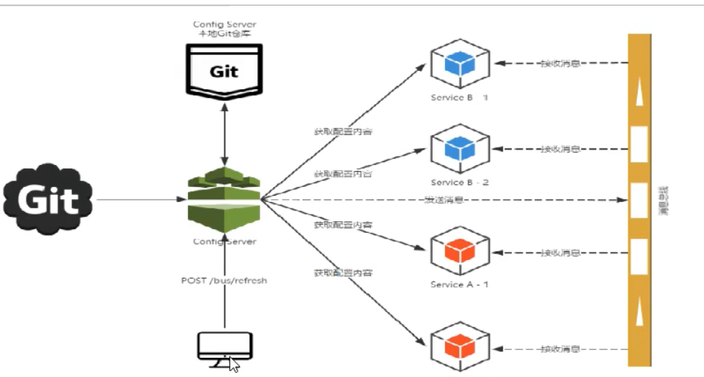

# Bus

## 原理

## 概念

spring cloud bus是用来将分布式系统的节点与轻量级消息系统链接起来的框架，它整合了Java的事件处理机制和消息中间件的功能。Bus能管理和传播分布式系统间的消息，就像一个分布式执行器，可用于广播状态更改、事件推送等，也可以当作微服务间的通信通道。

### 总线

在微服务架构的系统中，通常会使用轻量级的消息代理来构建一个公共的消息主题，并让系统中所有微服务实例都连接上来。由于该主题中产生的消息会被所有实例监听和消费，所有称为消息总线。

基本原理

ConfigClient实例都监听MQ中同一个topic（默认是SpringCloudBus）。当一个服务刷新数据的时候，它会把这个信息放入到Topic中，这样其它监听同一Topic的服务就能得到通知，然后更新自身的配置。