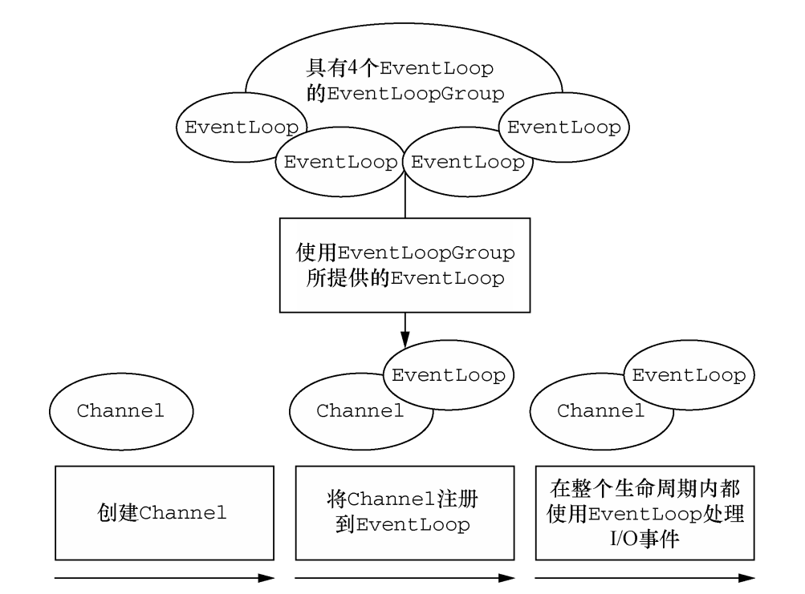

# Netty

Netty 是一个异步事件驱动的网络应用程序框架，用于快速开发可维护的高性能协议服务器和客户端。

## 特性

### 设计

- 用于各种传输类型的统一 API - 阻塞和非阻塞套接字
- 基于灵活且可扩展的事件模型，允许明确的关注点分离
- 高度可定制的线程模型——单线程、SEDA等一个或多个线程池
- 真正的无连接数据报套接字支持（自 3.1 起）

### 易于使用

- 文档齐全的 Javadoc、用户指南和示例
- 没有额外的依赖，JDK 5（Netty 3.x）或 6（Netty 4.x）就足够了

### 性能

- 高吞吐低延时
- 资源消耗少
- 最小化不必要的内存复制

### 安全性

- 完整的 SSL/TLS 和 StartTLS 支持

## 线程模型

Netty线程模型基于主从Reactor并进行优化改造。

1. Netty 抽象出两组线程池：BossGroup 和 WorkerGroup，也可以叫做 BossNioEventLoopGroup 和 WorkerNioEventLoopGroup。每个线程池中都有 NioEventLoop 线程。BossGroup 中的线程专门负责和客户端建立连接，WorkerGroup 中的线程专门负责处理连接上的读写。BossGroup 和 WorkerGroup 的类型都是 NioEventLoopGroup。
2. NioEventLoopGroup 相当于一个事件循环组，这个组中含有多个事件循环，每个事件循环就是一个 NioEventLoop。
3. NioEventLoop 表示一个不断循环的执行事件处理的线程，每个 NioEventLoop 都包含一个 Selector，用于监听注册在其上的 Socket 网络连接（Channel）。
4. NioEventLoopGroup 可以含有多个线程，即可以含有多个 NioEventLoop。
5. 每个 BossNioEventLoop 中循环执行以下三个步骤：
   1. **select**：轮训注册在其上的 ServerSocketChannel 的 accept 事件（OP_ACCEPT 事件）
   2. **processSelectedKeys**：处理 accept 事件，与客户端建立连接，生成一个 NioSocketChannel，并将其注册到某个 WorkerNioEventLoop 上的 Selector 上
   3. **runAllTasks**：再去以此循环处理任务队列中的其他任务
6. 每个 WorkerNioEventLoop 中循环执行以下三个步骤：
   1. **select**：轮训注册在其上的 NioSocketChannel 的 read/write 事件（OP_READ/OP_WRITE 事件）
   2. **processSelectedKeys**：在对应的 NioSocketChannel 上处理 read/write 事件
   3. **runAllTasks**：再去以此循环处理任务队列中的其他任务
7. 在以上两个**processSelectedKeys**步骤中，会使用 Pipeline（管道），Pipeline 中引用了 Channel，即通过 Pipeline 可以获取到对应的 Channel，Pipeline 中维护了很多的处理器（拦截处理器、过滤处理器、自定义处理器等）。

## 组件

### Bootstrap

bootstrap用于引导Netty的启动，Bootstrap是客户端的引导类，ServerBootstrap是服务端的引导类。

### Channel

- Netty网络通信的组件，用于网络IO操作
- 通过Channel可以获得当前网络连接通道的状态与网络配置参数
- Channel提供异步的网络IO操作，调用后立即返回ChannelFuture，通过注册监听，或者同步等待，最终获取结果

### Selector

Netty基于java nio的Selector实现IO多路复用，通过Selector一个线程可以监听多个连接的Channel事件。当向一个Selector中注册Channel后，Selector内部的机制就可以自动不断的轮询这些注册的Channel是否有就绪的IO事件（可读、可写、网络连接完成等）。

### NIOEventLoop

- 一个EventLoopGroup可以包含多个EventLoop
- 一个EventLoop在它的生命周期内只和一个thread绑定
- 所有由EventLoop处理的IO事件都将在它专有的thread上处理
- 一个Channel在它的生命周期内只注册在一个EventLoop上
- 一个EventLoop可以包含多个Channel

一个Channel的IO所有操作都在一个EventLoop中的thread中执行，避免了多线程同步问题。

### ChannelFuture

Netty中的所有操作都是异步的，可以将 ChannelFuture 看作是将来要执行的操作的结果的占位符。Netty 提供了ChannelFuture 接口，其 addListener()方法注册了一个ChannelFutureListener，以便在某个操作完成时（无论是否成功）得到通知。  

### ChannelHandler

ChannelHandler属于业务的核心接口，用于处理IO事件或者拦截IO操作，并将其转发ChannelPipeline（业务处理链）中的下一个处理程序。

### ChannelPipeline

- ChannelPipeline是一个handler的集合，它负责处理和拦截出站和入站的事件和操作。

- ChannelPipeline实现了拦截过滤器模式，使用户能控制事件的处理方式。

- 在Netty中，每个Channel都有且只有一个ChannelPipeline与之对应。

### ChannelHandlerContext

ChannelHandlerContext 代表了 ChannelHandler 和 ChannelPipeline 之间的关联，每当有ChannelHandler 添加到 ChannelPipeline 中时， 都会创建 ChannelHandlerContext。ChannelHandlerContext 的主要功能是管理它所关联的 ChannelHandler 和在同一个 ChannelPipeline 中的其他 ChannelHandler 之间的交互。  